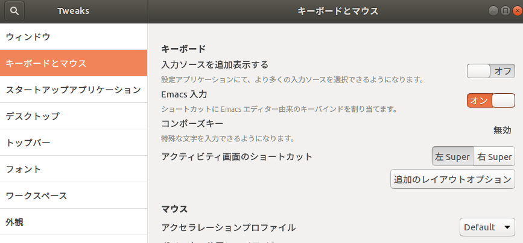
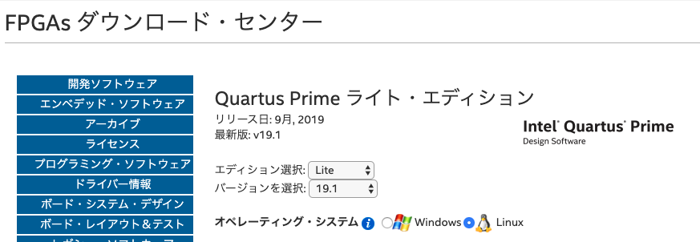
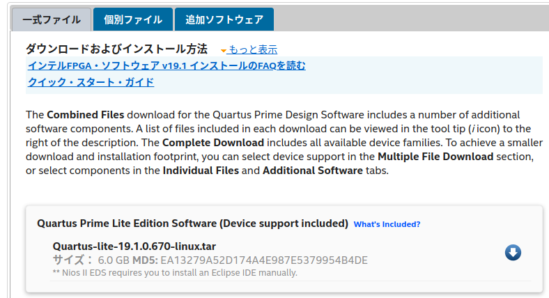
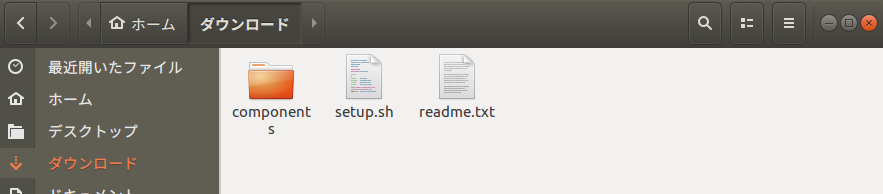
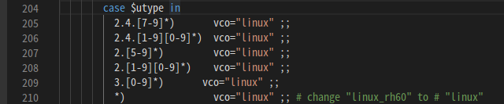
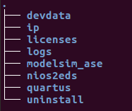
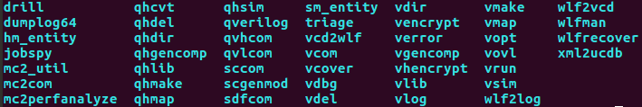
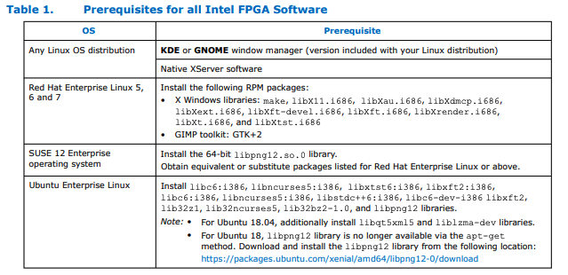

# 実験の準備
## macOSの方
### 1. virtual boxでUbuntu18.04LTSの以下（かそれ以上のメモリ、ストレージ）の仮想環境を作成

**メモリ8GB, ストレージ64GB以上（Modelsimのフリー版が約15GB以上あるため）**

### 2. macOSのshortcut keyを使いたい方(ctrl+a, e, f, h...)
tweaksをinstall
```
$ sudo apt install gnome-tweaks
```
以下のようにemacsのkey bindを有効化


***以下Ubuntu18.04LTSを前提で説明していく***

## インストール
詳しくない場合以下の手順通りに実行することを推奨

### 1. vscodeとgitをインストール
Ubuntu vscode(or git)インストールと調べたやり方で基本的によい

cf)[vscode](https://qiita.com/yoshiyasu1111/items/e21a77ed68b52cb5f7c8), [git](https://qiita.com/tommy_g/items/771ac45b89b02e8a5d64)

またvscodeには下記拡張をいれておいてください
* SystemVerilog - Language Support
* svls-vscode

### 2. Quartus Prime(Modelsim) フリー版をインストール
[Downloadリンク](https://fpgasoftware.intel.com/19.1/?edition=lite&platform=linux)
- アドレスは割とコロコロ変わるので注意
- intelのアカウントが必要なのでとりあえず登録する

下画像の様にlite版のlinuxを選択して、一式ファイルのQuartus Prime Lite Edition Software (Device support included) をダウンロード



展開し、以下の様なファイルとなると思うので、展開先のディレクトリ下に入りsetup.shを実行する（componentsとsetup.shは同じディレクトリ以下に展開する必要あり）
```
$ sh setup.sh
```


installが始まる（全てdefaultでcheckされているままで良い）

### 3. modelsimに必要な設定
#### 3-1. 環境変数の設定
bashrc, bash_profileに以下の様にpathの環境変数を設定
```
export H3_MODELSIM_PATH=~/intelFPGA_lite/19.1/modelsim_ase/bin
```

#### 3-2. ~/intelFPGA_lite/19.1/modelsim_ase/bin/vsimを修正
以下の様に"linux_60rh"を"linux"に変更


#### 3-3. 必要なpackageのインストール
32bitアーキテクチャを追加、gcc, g++, makeなどをインストール
```
$ sudo dpkg --add-architecture i386
$ sudo apt update
$ sudo apt install build-essential
```

足りて無い32bitのライブラリをインストール
```
$ wget http://security.ubuntu.com/ubuntu/pool/main/libp/libpng/libpng12-0_1.2.54-1ubuntu1.1_amd64.deb
$ wget http://security.ubuntu.com/ubuntu/pool/main/libp/libpng/libpng12-0_1.2.54-1ubuntu1.1_i386.deb
$ wget http://archive.ubuntu.com/ubuntu/pool/main/f/freetype/libfreetype6_2.6.1-0.1ubuntu2_i386.deb
$ wget http://archive.ubuntu.com/ubuntu/pool/main/f/freetype/libfreetype6_2.6.1-0.1ubuntu2_amd64.deb
$ sudo dpkg -i libpng12-0_1.2.54-1ubuntu1.1_i386.deb
$ sudo dpkg -i libpng12-0_1.2.54-1ubuntu1.1_amd64.deb
$ sudo dpkg -i libfreetype6_2.6.1-0.1ubuntu2_i386.deb
$ sudo dpkg -i libfreetype6_2.6.1-0.1ubuntu2_amd64.deb

$ sudo apt install gcc-multilib g++-multilib \
lib32z1 lib32stdc++6 lib32gcc1 \
expat:i386 fontconfig:i386 libfreetype6:i386 libexpat1:i386 libc6:i386 libgtk-3-0:i386 \
libcanberra0:i386 libpng12-0:i386 libice6:i386 libsm6:i386 libncurses5:i386 zlib1g:i386 \
libx11-6:i386 libxau6:i386 libxdmcp6:i386 libxext6:i386 libxft2:i386 libxrender1:i386 \
libxt6:i386 libxtst6:i386
```

#### 3-x. 初見時の過程（備忘録用、とばしてもらって大丈夫です）
2までが終わったら環境変数のpathの設定のためにtutorial/adder/Makefileを見てみると **.exeを実行する様に書いてある。

もちろんLinux環境なので動くはずないですし、そもそもLinux用のQuartusをダウンロードしているので **.exeファイルなんてないです。そこでダウンロードしたQuartusを見て行きます。defaultのままダウンロードしたのなら ~/intelFPGA_liteというディレクトリがあると思います。

そこで~/intelFPGA_lite/19.1(download version) 以下を見てみましょう。


おっ！ modelsim_aseがありました。

次はmodelsim_ase/bin以下をみてみましょう。

vlog.exe, vlib.exe, vsim.exeの代わりにvlog, vlib, vsimがあります。（やったね！）

modelsim.exeの代わりはないですがとりあえず環境変数のpathはわかったでしょう。
bashrcやbash_profileに以下の様に設定すれば、 tutorail/adder下のMakeでmake, make simが動きそうです。
```
export H3_MODELSIM_PATH=~/intelFPGA_lite/19.1/modelsim_ase/bin
```

しかし実行するとこの様なerrorが返ってくると思います。
```
:<errorの行数> ./../linux_60rh/vsim not found
```
うーん、では実際にvsimの中身をみてみると...

変更前は210行の部分は"linux_60rh"になっていました。これはLinuxカーネルのversionによって分岐しているのですが、versionが4以降が全てlinux_60rhに分岐してしまいます。そこでここをまずは"linux"に変更しましょう。


これで動くだろうと思ったが、やっぱり動かない...
しょうがない[document](https://www.intel.com/content/dam/www/programmable/us/en/pdfs/literature/manual/quartus_install.pdf)を読んで見よう。ふむふむどうやら以下の様に32bitのパッケージが必要な様だ。


とりあえず32bitのアーキテクチャを追加して、書いてあるのを入れてみよう。
（lib32bz2-1.0はすでになく、libbz2-1.0:i386になっています。）
```
$ dpkg --add-architecture i386
$ sudo apt install libc6:i386 libncurses5:i386 libstdc++6:i386 libc6-dev-i386 libxft2 lib32z1 lib32ncurses5 libbz2-1.0:i386 libqt5xml5 liblzma-dev
````
libpng12は[リンク](https://packages.ubuntu.com/xenial/amd64/libpng12-0/download)からダウンロードして、インストールする。
```
$ dpkg -i libpng12-0_1.2.54-1ubuntu1.1_i386.deb
```

さぁ！これで十分だろ！と思ってmake simを実行すると、今度は下の様なerror文がでる
```
./../linux/vish: error while loading shared libraries: libXft.so.2: cannot open shared object file: No such file or directory
```
どうやらvishの共有ライブラリが足りないようなので、何が足りてないかみてみよう
```
~/intelFPGA_lite/19.1/modelsim_ase/linux$ ldd vish
	linux-gate.so.1 (0xf7f21000)
	libpthread.so.0 => /lib/i386-linux-gnu/libpthread.so.0 (0xf7ee6000)
	libdl.so.2 => /lib/i386-linux-gnu/libdl.so.2 (0xf7ee1000)
	libm.so.6 => /lib/i386-linux-gnu/libm.so.6 (0xf7ddf000)
	libX11.so.6 => not found
	libXext.so.6 => not found
	libXft.so.2 => not found
	libXrender.so.1 => not found
	libfontconfig.so.1 => not found
	librt.so.1 => /lib/i386-linux-gnu/librt.so.1 (0xf7dd5000)
	libncurses.so.5 => /lib/i386-linux-gnu/libncurses.so.5 (0xf7daf000)
	libc.so.6 => /lib/i386-linux-gnu/libc.so.6 (0xf7bd1000)
	/lib/ld-linux.so.2 (0xf7f22000)
	libtinfo.so.5 => /lib/i386-linux-gnu/libtinfo.so.5 (0xf7bae000)
```
無い共有ライブラリの32bitバージョンをインストールしていく
```
libx11.so.6           =>       libx11-6:i386
libXext.so.6          =>       libxext6:i386
libXft.so.2           =>       libxft2:i386
ibXrender.so.1        =>       libxrender1:i386
libfontconfig.so.1    =>	   fontconfig:i386
```
今度こそはとmake simを実行すると以下の様なerrorとなった。
```
...
"ncFyP12 -+"
    (file "/mtitcl/vsim/vsim" line 1)
** Fatal: Read failure in vlm process (0,0)
```
これは分からないのググると、libfreetype2 のバージョンが高いとエラーを起こすらしい。というわけで、こちらの[サイト](https://askubuntu.com/questions/1121815/how-do-i-run-mentor-modelsim-questa-in-ubuntu-18-04)を参考にして
```
$ wget http://security.ubuntu.com/ubuntu/pool/main/libp/libpng/libpng12-0_1.2.54-1ubuntu1.1_amd64.deb
$ wget http://security.ubuntu.com/ubuntu/pool/main/libp/libpng/libpng12-0_1.2.54-1ubuntu1.1_i386.deb # これは既に入ってます
$ wget http://archive.ubuntu.com/ubuntu/pool/main/f/freetype/libfreetype6_2.6.1-0.1ubuntu2_i386.deb
$ wget http://archive.ubuntu.com/ubuntu/pool/main/f/freetype/libfreetype6_2.6.1-0.1ubuntu2_amd64.deb
$ sudo dpkg -i libpng12-0_1.2.54-1ubuntu1.1_i386.deb
$ sudo dpkg -i libpng12-0_1.2.54-1ubuntu1.1_amd64.deb
$ sudo dpkg -i libfreetype6_2.6.1-0.1ubuntu2_i386.deb # これは既にinstallされています
$ sudo dpkg -i libfreetype6_2.6.1-0.1ubuntu2_amd64.deb
```
これでようやくmake simで起動！　めでたしめでたし

ただし、他のパッケージを入れる際に2.6.1-0.1ubuntu2以上が要求されて、それを入れてしまうと、upgradeされてしまうので、以下を再度実行してdowngradeする必要があります。
```
$ sudo dpkg -i libpng12-0_1.2.54-1ubuntu1.1_i386.deb
$ sudo dpkg -i libpng12-0_1.2.54-1ubuntu1.1_amd64.deb
$ sudo dpkg -i libfreetype6_2.6.1-0.1ubuntu2_i386.deb
$ sudo dpkg -i libfreetype6_2.6.1-0.1ubuntu2_amd64.deb
```

## シミュレーションのテスト
ここまでの設定がうまく行っているかを確認するため，加算器のシミュレーションを行ってみます．

### 1. Makefileの編集
**.exeの様に書かれている場合それはwindows用になっているので[ここ](./../tutorial/adder/Makefile)の様に変更する

### 2. シミュレーションの実行
make と打って Enter を押す。下のように出ればOK
```
Model Technology ModelSim ALTERA vlog 6.6d Compiler 2010.11 Nov  2 2010
-- Compiling module Adder
-- Compiling module H3_Simulator

Top level modules:
        H3_Simulator
```

make sim-gui と打って Enter を押す．

シミュレータが立ち上がり，シミュレータ内の左上にあるviewでTransciptを選択した時に以下のように加算の結果が出ていればOK
```
    #  run 50ns
    #          0 a(    1) *  b(    8) = c(    9)
    #         40 a(    9) *  b(    6) = c(   15)
```

